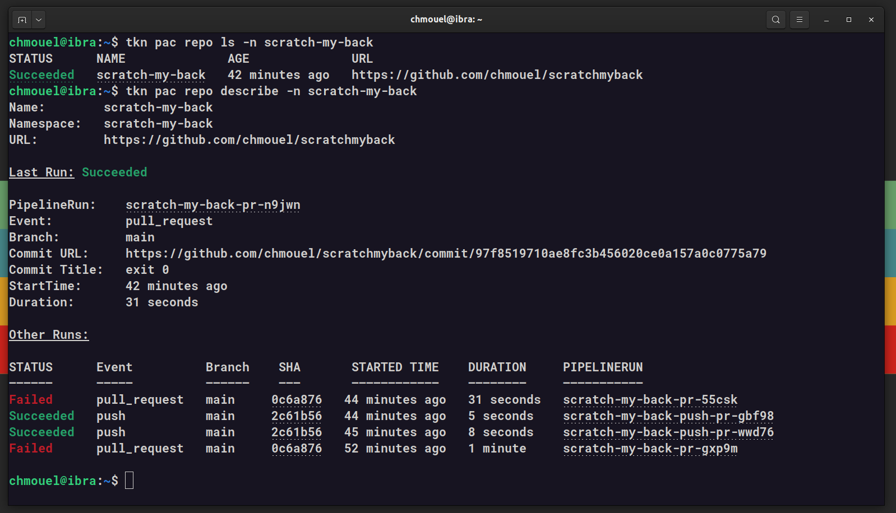

# Pipelines as Code CLI


Pipelines as Code provide a powerful CLI designed to work with tkn plugin.  tkn-pac allows you to :

* bootstrap: quickly bootstrap a Pipelines as Code installation.
* create: create a new Pipelines as Code Repository.
* generate: generate a simple pipelinerun to get you started with Pipelines as Code.
* list: list Pipelines as Code Repositories.
* describe: describe a Pipelines as Code Repository and the runs associated with it.
* resolve: Resolve a pipelinerun as if it were executed by pipelines as code on service.

## Install

### Binary releases

You can grab the latest binary directly from the
[releases](https://github.com/openshift-pipelines/pipelines-as-code/releases)
page.

### Dev release

If you want to install from the git repository you can just do :

```shell
go install github.com/openshift-pipelines/pipelines-as-code/cmd/tkn-pac
```

### Brew release

On [LinuxBrew](https://docs.brew.sh/Homebrew-on-Linux) or [OSX brew](https://brew.sh/) you can simply add the Brew tap
to have the tkn-pac plugin and its completion installed :

```shell
brew install openshift-pipelines/pipelines-as-code/tektoncd-pac
```

and simply upgrade with :

```shell
brew upgrade openshift-pipelines/pipelines-as-code/tektoncd-pac
```

### Container

`tkn-pac` is as well available as a container :

```shell
# use docker
podman run -e KUBECONFIG=/tmp/kube/config -v ${HOME}/.kube:/tmp/kube \
     -it quay.io/openshift-pipeline/pipelines-as-code tkn-pac help
```

## Commands

### bootstrap

`tkn pac bootstrap` command will help you getting started installing and configuring Pipelines as code. It currently supports the following providers:

* Github application on public Github
* Github application on Github Enterprise

It will start checking if you have installed Pipelines as Code and if not it will ask you if you want to  install (with `kubectl`) the latest stable release. If you add the flag `--nightly` it will install the latest code ci release.

Bootstrap detect the OpenShift Route automatically associated to the Pipelines as code controller service.
If you don't have an OpenShift install it will ask you for your public URL (ie: an ingress spec url)
You can override the URL with the flag `--route-url`.

### bootstrap github-app

If you only want to create the Github application you can use `tkn pac bootstrap
github-app` directly which would skip the installation and only create the
github application and the secret with all the information needed in the
`pipelines-as-code` namespace.

### Repository creation

`tkn pac repo create` -- will create a new Pipelines as Code Repository and a namespace where the pipelineruns command. It will launch the `tkn pac generate` command right after the creation.

### Repository Listing

`tkn pac repo list` -- will list all the Pipelines as Code Repositories and display the last status of the runs associated with it.

### Repository Describe

`tkn pac repo describe` -- will describe a Pipelines as Code Repository and the runs associated with it.

On modern terminal (ie: [iTerm2](https://iterm2.com/), [Windows Terminal](https://github.com/microsoft/terminal), gnome-terminal etc..) the links are clickable via control+click or ⌘+click and will open the browser to the UI URL to see the Pipelinerun associated with it.

### Generate

`tkn pac generate`: will generate a simple pipelinerun to get you started with Pipelines as Code. It will try to be as smart as possible by detecting the current git information if you run the command from your source code.

It has some basic language detection and add extra task depending of the language. For example if it detects a file named `setup.py` at the repository root it will add the [pylint task](https://hub.tekton.dev/tekton/task/pylint) to the generated pipelinerun.

### Resolve

`tkn-pac resolve`: will run a pipelinerun as if it were executed by pipelines
as code on service.

For example if you have a pipelinerun in the `.tekton/pull-request.yaml` file you can run the command `tkn-pac resolve` to see it running:

```yaml
tkn pac resolve -f .tekton/pull-request.yaml|kubectl apply -f -
```

Combined with a kubernetes install running on your local machine (like[Code Ready Containers](https://developers.redhat.com/products/codeready-containers/overview) or [Kubernetes Kind](https://kind.sigs.k8s.io/docs/user/quick-start/) ) you can see your run in action without having to generate a new commit.

If you run the command from your source code repository it will try to detect the current git information and resolve the parameters like current revision or branch. You can override those params with the `-p` option. For example if you want to use a git branch as revision and another repo name than the current repo name you can just use :

`tkn pac resolve -f .tekton/pr.yaml -p revision=main -p repo_name=othername`

`-f` can as well accept a directory path instead of just a filename and grab every `yaml`/`yml` from the directory.

You can specify multiple `-f` on the command line.

You need to make sure that git-clone task (if you use it) can access the repository to the SHA. Which mean if you test your current source code you need to push it first tbefore using `tkn pac resolve|kubectl apply`.

Compared with running directly on CI, you need to explicitely specify the list of filenames or directory where you have the templates.
